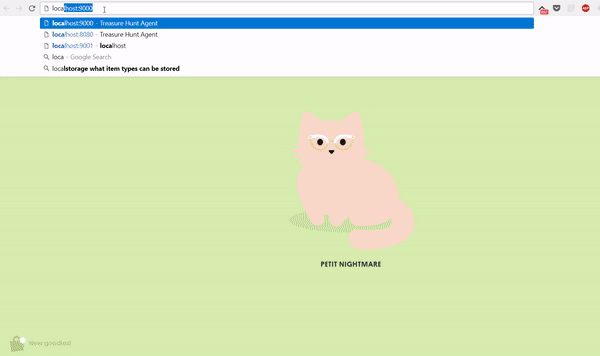

Treasure Hunt Agent Visualizer
===============================

This is a program to provide visualisation for the COMP9414 Artificial Intelligence course Treasure Hunt Agent assignment: http://www.cse.unsw.edu.au/~cs3411/17s1/hw3raft/  
The program can be dropped in the middle of Raft Java server and Agent client, and it will render the map and agent movements in the browser. This requires no changes in the existing server or client. Requires python 3.  
See it in action: https://www.youtube.com/watch?v=Ip4hXgEUhGU
  

  
Prerequisites
--------------
Visualizer requires some additional python3 modules. Install them as follows:  
`pip install aiohttp aiohttp_index python-socketio` (You might want to use `pip3` if pip is linked with python2)  
  
How to run
-----------
1. Run Raft server: `java Raft -p 3000 -i s0.in`
2. Run visualizer server with the same arguments: `python3 server.py -p 3000 -i ../src/s0.in`
  - By default visualizer will run web server on port 9000 and mock server on port 9001
  - Above ports can be overridden as: `python3 server.py -p 3000 -i s0.in -w 9000 -v 9001`
3. Open `http://localhost:9000` in web browser
4. Run Agent client: `./agent -p 9001` 
  - Note that agent connects to the visualizer server, the same way it would have connected to Raft server.  
  
How it works
-------------
The visualizer server connects to the Raft Java server as if it is the Agent client.  
The Agent client program then connects to the visualizer server the same way it does to the Raft server.  
Having mocked both the parts, the agent client and Raft server will send messages as usual, but these will now be relayed through the visualizer server. The visualizer also forwards the commands to the browser, so that the changes can be rendered in real time.  
  
Interface controls
-------------------
The web interface will reload automatically when the servers are stopped and started again. so that the new map is rendered.
You can zoom in/out of the map with mouse scroll.  
By default camera is locked onto the agent, so that the view is focused on agent. Press 'F' to toggle this, which will enable you to drag the map to see off-screen parts.  
